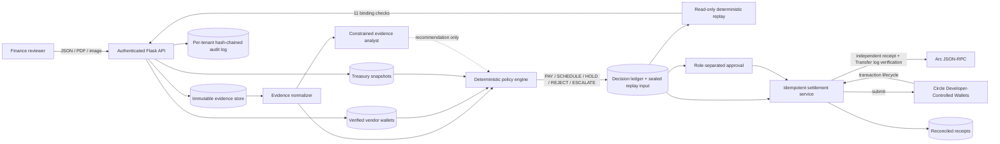
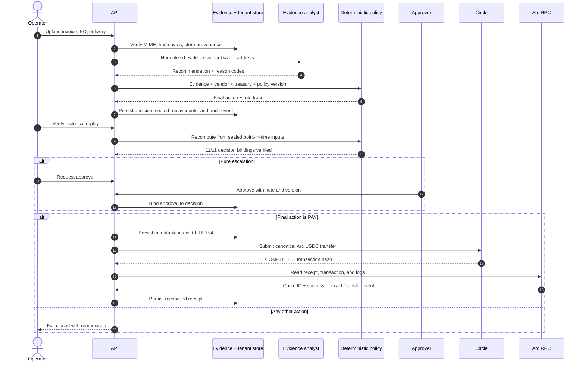
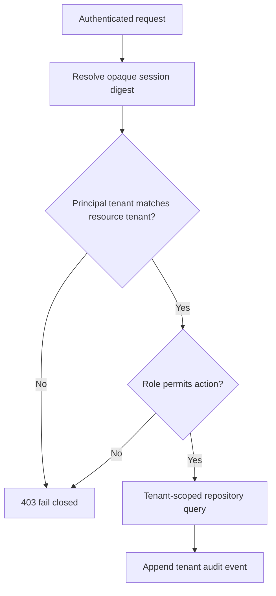

# TallyGuard architecture and trust boundaries

## System shape

TallyGuard separates probabilistic interpretation from deterministic payment authority. The
agent may summarize evidence and recommend an action, but only the policy service can produce a
payable decision, and only the settlement service can turn that decision into an immutable
payment intent.

Solid arrows can affect durable state. The dotted arrow is advisory and cannot contain a
recipient, amount, network, transaction, or approval value.

## Trust zones

| Zone | Trusted for | Explicitly not trusted for |
| --- | --- | --- |
| Browser console | Human review and initiating authenticated actions | Policy enforcement, tenant isolation, settlement facts |
| API and RBAC | Authentication, authorization, tenant scope, input limits | Making a payable decision by itself |
| Evidence store | Original bytes, hashes, field provenance, package manifest | Deciding whether evidence is sufficient |
| Evidence analyst | Structured explanation, confidence, reason codes | Recipient, amount, network, approval, or payment authority |
| Policy engine | Deterministic final action and remediation | Signing or submitting a transaction |
| Approval service | Segregated authorization of pure escalations | Overriding HOLD or REJECT controls |
| Settlement service | Immutable intent, idempotency, reconciliation | Reinterpreting evidence or changing the decision |
| Circle Wallets | Transaction origination and lifecycle | Final proof that the expected Arc transfer occurred |
| Arc RPC | Independent onchain receipt and exact Transfer log | Business authorization |

## Evidence-to-payment sequence

## Settlement invariants

1. Only a deterministic `PAY` decision can reach an adapter.
2. Mainnet additionally requires an explicit runtime flag and a recorded approval reference.
3. The intent's tenant, invoice, decision, recipient, amount, network, and idempotency key are
   immutable after creation.
4. A retry reuses the persisted UUID v4 and returns the stored receipt after confirmation.
5. Circle `COMPLETE` is necessary but not sufficient.
6. Arc RPC must independently prove the expected chain, successful receipt, canonical USDC
   contract call, recipient topic, and six-decimal atomic amount.
7. A mismatch at any boundary fails closed and creates no confirmed receipt.
8. A batch is only an orchestration envelope. It cannot share authorization or idempotency across
   invoices, and one failed item cannot alter another item's durable intent or receipt.
9. Before a new intent or provider submission, the active tenant policy's emergency kill switch is
   checked again. A completed receipt may still be replayed under a later stop because that path
   returns existing proof and never resubmits funds.
10. Active route, autonomy, treasury freshness, daily-limit, and reserve controls are checked in the
    same serialized database transaction that reserves a new payment intent. The calculation adds
    every durable intent created after the latest source balance, preventing concurrent workers from
    spending the same observed headroom twice.

## Historical decision replay

Every new decision persists a canonical snapshot of the exact normalized evidence, verified vendor,
treasury balances, immutable policy, known duplicate fingerprints, settlement route, and evaluation
date used by the policy engine. Its SHA-256 hash is included in the decision identity. The auditor
endpoint recomputes the policy result from that snapshot and compares 11 independent bindings:
snapshot hash, organization, invoice, evidence manifest, policy version, policy content, action,
final action, invoice fingerprint, full rule trace, and decision ID. Current vendor, treasury, and
policy state are deliberately not consulted, so configuration changes cannot rewrite history.

## Payment Evidence Packet

The auditor can export one content-addressed JSON packet per invoice. The packet binds evidence
metadata and source hashes, sealed replay inputs, the 11 replay checks, any role-separated approval,
the reconciled settlement receipt, and invoice-scoped audit events. The response exposes the
SHA-256 of canonical packet JSON in both the body and `X-TallyGuard-Packet-SHA256`. Original source
bytes remain available through separately authorized evidence downloads and are not copied into
the packet.

## Policy what-if boundary

An administrator may run a temporary policy patch against a decision's sealed replay inputs. Only
explicit policy fields are accepted; vendor identity, recipient, amount, evidence, route, and
evaluation date cannot be replaced through this endpoint. The result is returned as a comparison
only. It does not persist a policy or decision, emit an audit mutation, satisfy an approval, create a
payment intent, or call a settlement provider. This keeps planning and control analysis outside the
authorization path.

## Scheduled release boundary

`SCHEDULE` is a durable control outcome, not a delayed provider call. The release date is derived
from the invoice due date and the schedule lead time inside the sealed decision snapshot. The
tenant-scoped runner refuses execution before that date. Once due, it evaluates the immutable
evidence again with the current verified vendor, active policy, latest treasury snapshot, duplicate
set, and Arc route. Only a new `PAY` decision advances the invoice to `READY` and enters the same
idempotent settlement orchestrator used by immediate payments. A newly active kill switch, depleted
treasury, changed wallet, or other failed control therefore stops payment before an intent exists.

## Approval governance boundary

The exception inbox is a tenant-scoped work queue, not a shortcut around policy. Only principals
with `PAYMENT_APPROVE` permission can list or resolve pending records, and the requesting user cannot
approve their own escalation. The governance overview joins each pending approval to its immutable
decision and current invoice while exposing the active policy content hash and operative limits.
Approval moves the invoice from `ESCALATED` to `READY`; rejection moves it to terminal `REJECTED`.
Both paths are version-checked and audit recorded. Neither path calls Circle or creates an intent,
so settlement still passes through the independent deterministic authorization and idempotency
boundary.

Policy edits never mutate an existing version. The governance workbench sends a complete proposed
policy, activates a newly named and content-addressed version, then requests a server-side diff
against the previous version. The active kill switch is additionally checked on the execution path,
so activating an emergency stop blocks invoices that were already `READY` under an older decision.
This execution-time gate records the blocking policy version and hash in the audit chain before
failing closed.

The governance overview also computes a read-only settlement-capacity projection from the same
durable sources. It reports the latest observed balance and spend, intent commitments since that
observation, effective available balance, remaining daily limit, reserve floor, snapshot freshness,
and the smaller of daily or reserve headroom as the maximum currently admissible payment. This is an
operational preview only; the authoritative check still runs atomically during intent reservation.

## Tenant isolation

Every durable financial record carries `organization_id`. Repository reads and mutations require
that scope, and authorization checks compare it with the authenticated principal before access.
Opaque bearer tokens are stored only as SHA-256 digests. Cross-tenant read probes are part of the
10,000-workflow reliability suite and all 100 recorded probes were denied.

## Runtime profiles

| Profile | Settlement | Demo identities | Intended use |
| --- | --- | --- | --- |
| Public judge | Deterministic simulator | Enabled | Safe product walkthrough and adversarial scenarios |
| Arc Testnet acceptance | Circle + Arc RPC | Isolated local test identities only | Real test USDC and failure-path verification |
| Arc Mainnet proof | Circle + Arc RPC, low cap, explicit gate and approval | Disabled | A deliberately low-value final proof only |

The public deployment never needs wallet credentials. Live Circle mode disables the demo-session
endpoint by default.

## Current deployment boundary

The hackathon deployment uses one Gunicorn process with multiple threads and SQLite. This is
appropriate for a reproducible judge environment and local acceptance testing, but not for a
multi-instance production treasury. Production migration requires managed Postgres, shared rate
limits, external identity, secret management, webhook-driven reconciliation, and worker-restart
recovery drills.
